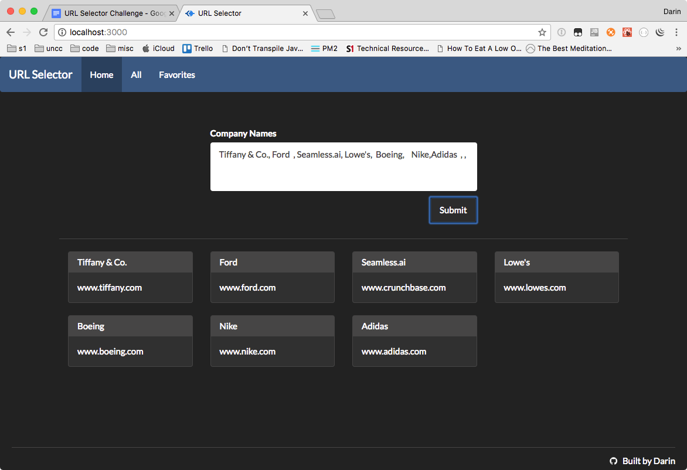

# url-selector

Web application where given a company name, it displays the domain associated to that company. The application is API driven, and it selects the most accurate company domain.

Company names are entered as a comma-delimited string on the Home screen. The application will parse that string and make subsequent calls to an API to resolve the domain name (url) for each company.

Additionally, searches are stored (cached) in MongoDB. The "Home" menu item let's you create URLs by querying the API. The "All" menu will display all previous searches, and provide you with options to either delete them, or add them to your favorites (each of these options are available by clicking the trash can or star icons, respectively). Finally, there is a "Favorites" menu that will display your favorites.

## Quickstart (Dev Mode)

```
  npm install
  npm run start
```

**Note : Please make sure your MongoDB is running.**

Navigate to localhost:3000 in your browser.



## Create Release Distribution

```
  npm run build
```

## Configuration

Google Customer Search API information can be modified in the ```config.dev.js``` file.

```
module.exports = {
  "gcsApi": {
    "url": "https://www.googleapis.com/customsearch/v1",
    "cx": "014250448920921571293:suxjtpgdmdc",
    "key": "AIwqSyAsgMgcMn7f39LfZgYRGS8pUeD92nm0lQU"
  }
}
```
